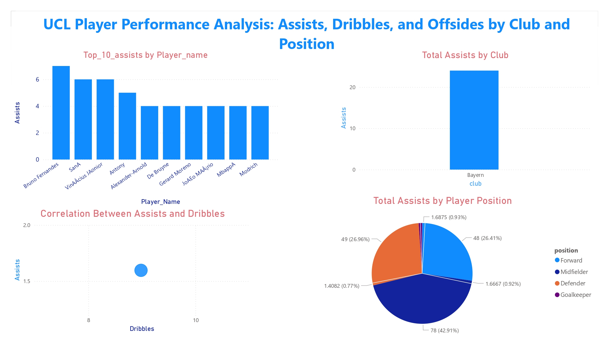

# Introduction
📊 Dive into the UEFA Champions League player stats! This project analyzes ⚽ top-performing players, 🏆 key performance metrics, and 📈 where standout skills align with exceptional on-field impact in the Champions League.


# Background
Driven by a quest to uncover the secrets of top performance in the UEFA Champions League, this project was born from a desire to pinpoint key skills and metrics that define elite players, streamlining insights for fans, coaches, and analysts to identify standout talents and game-changing performances.

### The questions I wanted to answer through my SQL queries were:

1. Which player has the highest number of assists?
2. What is the correlation between the number of dribbles and assists for players?
3. Which club has the highest total assists among its players?
4. How do assists vary by position? Are certain positions more likely to contribute assists?

# Tools I Used
For my deep dive into the data analyst job market, I harnessed the power of several key tools:

- **SQL:** The backbone of my analysis, allowing me to query the database and unearth critical insights.
- **MySql Workbench:** The chosen database management system, ideal for handling the job posting data.
- **Visual Studio Code:** My go-to for database management and executing SQL queries.
- **Git & GitHub:** Essential for version control and sharing my SQL scripts and analysis, ensuring collaboration and project tracking.

# The Analysis
Each query for this project aimed at investigating specific aspects of the data analyst job market. Here’s how I approached each question:

### 1. Which player has the highest number of assists?

```SELECT Player_name, 
       MAX(assists) AS highest_assists
FROM attacking
GROUP BY Player_name
ORDER BY highest_assists DESC
LIMIT 10;
```
### 2. What is the correlation between the number of dribbles and assists for players?

```SELECT AVG(dribbles) AS avg_dribbles, 
       AVG(assists) AS avg_assists,
       COUNT(*) AS n
FROM attacking;
```
### 3.Which club has the highest total assists among its players?

```SELECT club, 
       SUM(assists) AS total_assists
FROM attacking
GROUP BY club
ORDER BY total_assists DESC
LIMIT 1;
```

### 4.How do assists vary by position? Are certain positions more likely to contribute assists?

```SELECT position, 
       SUM(assists) AS total_assists,
       COUNT(Player_name) AS player_count,
       AVG(assists) AS avg_assists_per_player
FROM attacking
GROUP BY position
ORDER BY total_assists DESC;
```

# All Query Visualization



# What I Learned

🧩 Advanced Query Design: Expert in crafting sophisticated SQL queries, seamlessly merging tables, and skillfully using WITH clauses for dynamic temporary table operations.
📊 Data Summarization Mastery: Proficient in leveraging GROUP BY and wielding aggregate functions like COUNT() and AVG() to extract meaningful insights from data.
💡 Analytical Problem-Solving: Adept at transforming complex real-world problems into actionable and insightful SQL queries.

# Conclusions

This analysis not only highlights individual and team performances but also provides actionable insights for coaches, analysts, and fans. The data-driven approach allows for better understanding of player dynamics and strategies in competitive football. With further exploration of assists and attacking statistics, the overall analysis can provide a comprehensive picture of success factors in the UCL.

### Final Reflections

This project provided a meaningful opportunity to enhance my SQL skills while diving deep into the world of football analytics. Through this analysis, I gained valuable insights into player performance, scoring patterns, and efficiency metrics that reflect the intricate dynamics of the UEFA Champions League.
